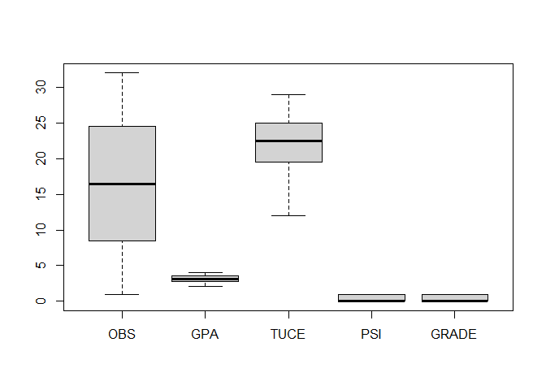
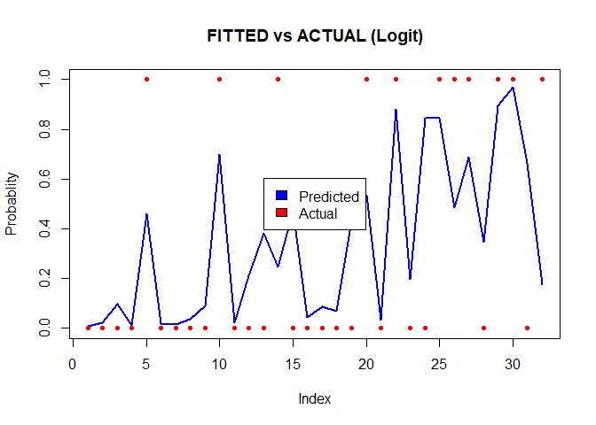
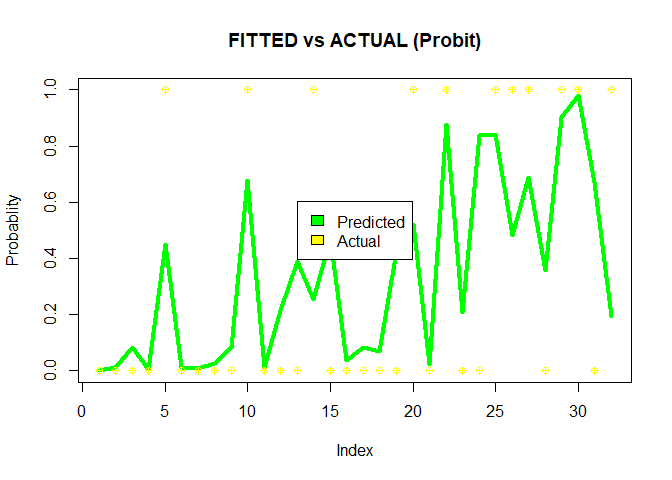
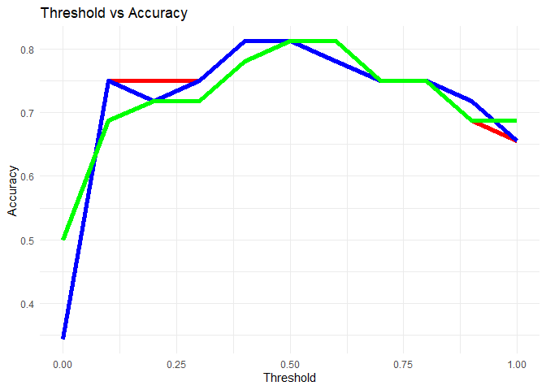
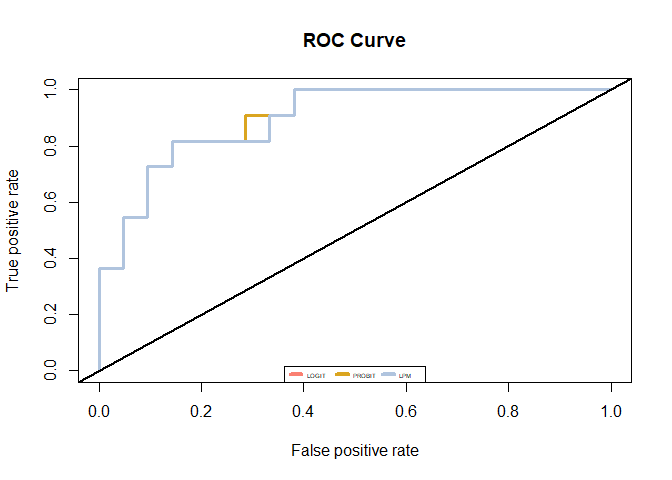

Personalized System of Instruction (PSI) - using - Classification
================

# 1.0 Importing Libraries

``` r
library(dplyr)
```

    ## 
    ## Attaching package: 'dplyr'

    ## The following objects are masked from 'package:stats':
    ## 
    ##     filter, lag

    ## The following objects are masked from 'package:base':
    ## 
    ##     intersect, setdiff, setequal, union

``` r
library(ggplot2)
library(readxl)
library(margins)
library(ROCR)
```

    ## 
    ## Attaching package: 'ROCR'

    ## The following object is masked from 'package:margins':
    ## 
    ##     prediction

# 2.0 Read data

``` r
grade =read_excel("C:/personal files/data analytics/docs/MODULE 3/t1/Grade.xlsx")
```

# 3.0 Inspecting Data

``` r
dim(grade)
```

    ## [1] 32  5

``` r
str(grade)
```

    ## tibble [32 x 5] (S3: tbl_df/tbl/data.frame)
    ##  $ OBS  : num [1:32] 1 2 3 4 5 6 7 8 9 10 ...
    ##  $ GPA  : num [1:32] 2.66 2.89 3.28 2.92 4 2.86 2.76 2.87 3.03 3.92 ...
    ##  $ TUCE : num [1:32] 20 22 24 12 21 17 17 21 25 29 ...
    ##  $ PSI  : num [1:32] 0 0 0 0 0 0 0 0 0 0 ...
    ##  $ GRADE: num [1:32] 0 0 0 0 1 0 0 0 0 1 ...

``` r
summary(grade)
```

    ##       OBS             GPA             TUCE            PSI        
    ##  Min.   : 1.00   Min.   :2.060   Min.   :12.00   Min.   :0.0000  
    ##  1st Qu.: 8.75   1st Qu.:2.812   1st Qu.:19.75   1st Qu.:0.0000  
    ##  Median :16.50   Median :3.065   Median :22.50   Median :0.0000  
    ##  Mean   :16.50   Mean   :3.117   Mean   :21.94   Mean   :0.4375  
    ##  3rd Qu.:24.25   3rd Qu.:3.515   3rd Qu.:25.00   3rd Qu.:1.0000  
    ##  Max.   :32.00   Max.   :4.000   Max.   :29.00   Max.   :1.0000  
    ##      GRADE       
    ##  Min.   :0.0000  
    ##  1st Qu.:0.0000  
    ##  Median :0.0000  
    ##  Mean   :0.3438  
    ##  3rd Qu.:1.0000  
    ##  Max.   :1.0000

``` r
boxplot(grade)
```

<!-- -->

-   The dataset constitutes 5 columns and 32 rows.
-   All the vaiables are in numeric format.
-   OBS and TUCE has higher variance and medians as compared GPA . PSI ,
    GRADE.

## 3.1 Getting glimpse of data

``` r
head(grade)
```

    ## # A tibble: 6 x 5
    ##     OBS   GPA  TUCE   PSI GRADE
    ##   <dbl> <dbl> <dbl> <dbl> <dbl>
    ## 1     1  2.66    20     0     0
    ## 2     2  2.89    22     0     0
    ## 3     3  3.28    24     0     0
    ## 4     4  2.92    12     0     0
    ## 5     5  4       21     0     1
    ## 6     6  2.86    17     0     0

``` r
tail(grade)
```

    ## # A tibble: 6 x 5
    ##     OBS   GPA  TUCE   PSI GRADE
    ##   <dbl> <dbl> <dbl> <dbl> <dbl>
    ## 1    27  3.39    17     1     1
    ## 2    28  2.67    24     1     0
    ## 3    29  3.65    21     1     1
    ## 4    30  4       23     1     1
    ## 5    31  3.1     21     1     0
    ## 6    32  2.39    19     1     1

# 4.0 Modelling

## 4.1 LPM

``` r
LPM=lm(GRADE ~ OBS +GPA + TUCE + PSI , grade)
summary(LPM)
```

    ## 
    ## Call:
    ## lm(formula = GRADE ~ OBS + GPA + TUCE + PSI, data = grade)
    ## 
    ## Residuals:
    ##     Min      1Q  Median      3Q     Max 
    ## -0.7668 -0.2436 -0.0134  0.1922  0.7593 
    ## 
    ## Coefficients:
    ##              Estimate Std. Error t value Pr(>|t|)   
    ## (Intercept) -1.546367   0.539690  -2.865  0.00797 **
    ## OBS          0.007440   0.014818   0.502  0.61969   
    ## GPA          0.462728   0.164179   2.818  0.00892 **
    ## TUCE         0.009621   0.019825   0.485  0.63138   
    ## PSI          0.260326   0.274507   0.948  0.35137   
    ## ---
    ## Signif. codes:  0 '***' 0.001 '**' 0.01 '*' 0.05 '.' 0.1 ' ' 1
    ## 
    ## Residual standard error: 0.3933 on 27 degrees of freedom
    ## Multiple R-squared:  0.4213, Adjusted R-squared:  0.3356 
    ## F-statistic: 4.914 on 4 and 27 DF,  p-value: 0.004153

-   As seen from linear probablity model the Rsq looses its significance
    in binary distribution of the predictors
-   Let’s run the logit model to overcome this issue

## 4.2 Logistic Regression (Logit Function)

``` r
logit_model =glm(GRADE ~ OBS + GPA + TUCE + PSI, data = grade , family  = binomial("logit"))
summary(logit_model)
```

    ## 
    ## Call:
    ## glm(formula = GRADE ~ OBS + GPA + TUCE + PSI, family = binomial("logit"), 
    ##     data = grade)
    ## 
    ## Deviance Residuals: 
    ##     Min       1Q   Median       3Q      Max  
    ## -1.9292  -0.5022  -0.2160   0.5210   1.8631  
    ## 
    ## Coefficients:
    ##              Estimate Std. Error z value Pr(>|z|)  
    ## (Intercept) -14.67183    5.72740  -2.562   0.0104 *
    ## OBS           0.09941    0.12340   0.806   0.4205  
    ## GPA           3.01151    1.35162   2.228   0.0259 *
    ## TUCE          0.09369    0.14622   0.641   0.5217  
    ## PSI           0.97157    1.96386   0.495   0.6208  
    ## ---
    ## Signif. codes:  0 '***' 0.001 '**' 0.01 '*' 0.05 '.' 0.1 ' ' 1
    ## 
    ## (Dispersion parameter for binomial family taken to be 1)
    ## 
    ##     Null deviance: 41.183  on 31  degrees of freedom
    ## Residual deviance: 25.091  on 27  degrees of freedom
    ## AIC: 35.091
    ## 
    ## Number of Fisher Scoring iterations: 5

-   We can see that only GPA turns out to be significant having
    significance level .05.

##### Calculating Margins

``` r
margins(logit_model)
```

    ## Average marginal effects

    ## glm(formula = GRADE ~ OBS + GPA + TUCE + PSI, family = binomial("logit"),     data = grade)

    ##      OBS    GPA    TUCE    PSI
    ##  0.01251 0.3789 0.01179 0.1222

#### Proportions of dependent variable

``` r
proportions(table(grade$GRADE))
```

    ## 
    ##       0       1 
    ## 0.65625 0.34375

-   The Distribution of grades is slightly skewed.

##### Plotting Actual vs Fitted results

``` r
plot(logit_model$fitted.values ,type = "l", ylim= c(0,1),col = "blue" , lwd = 2, lty = 1 , main  = "FITTED vs ACTUAL (Logit)", xlab = "Index" , ylab="Probablity")
lines(grade$GRADE , type = "p" , col= "red" , pch =20)
logit_model$fitted.values
```

    ##           1           2           3           4           5           6 
    ## 0.009120848 0.023925381 0.095580256 0.012662861 0.459762187 0.020436764 
    ##           7           8           9          10          11          12 
    ## 0.016765622 0.036753056 0.090291209 0.699374290 0.022219292 0.209836546 
    ##          13          14          15          16          17          18 
    ## 0.383757666 0.245934790 0.471478270 0.045229441 0.086426767 0.070444781 
    ##          19          20          21          22          23          24 
    ## 0.435164101 0.536542771 0.033964348 0.882010056 0.197967945 0.844456720 
    ##          25          26          27          28          29          30 
    ## 0.844767950 0.484116316 0.686842517 0.348042332 0.894914946 0.970193533 
    ##          31          32 
    ## 0.664728846 0.176287616

``` r
legend("center",c("Predicted" , "Actual") , fill = c("blue" , "red"))
```

<!-- -->

-   Seeing the Line chart we can confirm that there are more proportion
    of Fail “0” than Pass “1” and hance there is slight bump in
    probability at index of 22 that is and constitutes about 30% of
    grades.

## 4.2 Logistic Regression (probit)

``` r
probit_model =glm(GRADE ~ OBS + GPA + TUCE + PSI, family = binomial("probit"), 
    data = grade)

summary(probit_model)
```

    ## 
    ## Call:
    ## glm(formula = GRADE ~ OBS + GPA + TUCE + PSI, family = binomial("probit"), 
    ##     data = grade)
    ## 
    ## Deviance Residuals: 
    ##     Min       1Q   Median       3Q      Max  
    ## -1.9061  -0.4839  -0.1582   0.5326   1.8159  
    ## 
    ## Coefficients:
    ##             Estimate Std. Error z value Pr(>|z|)   
    ## (Intercept) -8.67376    3.11103  -2.788   0.0053 **
    ## OBS          0.06358    0.07090   0.897   0.3698   
    ## GPA          1.78225    0.75500   2.361   0.0182 * 
    ## TUCE         0.05228    0.08511   0.614   0.5390   
    ## PSI          0.51668    1.13621   0.455   0.6493   
    ## ---
    ## Signif. codes:  0 '***' 0.001 '**' 0.01 '*' 0.05 '.' 0.1 ' ' 1
    ## 
    ## (Dispersion parameter for binomial family taken to be 1)
    ## 
    ##     Null deviance: 41.183  on 31  degrees of freedom
    ## Residual deviance: 24.789  on 27  degrees of freedom
    ## AIC: 34.789
    ## 
    ## Number of Fisher Scoring iterations: 7

-   We can see that only GPA turns out to be significant having
    significance level .05.

##### Calculating margins

``` r
margins(probit_model)
```

    ## Average marginal effects

    ## glm(formula = GRADE ~ OBS + GPA + TUCE + PSI, family = binomial("probit"),     data = grade)

    ##      OBS    GPA    TUCE    PSI
    ##  0.01354 0.3796 0.01114 0.1101

### Plotting Actual vs Fitted results

``` r
plot(probit_model$fitted.values ,type = "l", ylim= c(0,1),col = "green" , lwd = 4, lty = 1 , main  = "FITTED vs ACTUAL (Probit)", xlab = "Index" , ylab="Probablity")
lines(grade$GRADE , type = "p" , col= "yellow" , pch =10)

legend("center",c("Predicted" , "Actual") , fill = c("green" , "yellow"))
```

<!-- -->

-   Seeing the Line chart we can confirm that there are more proportion
    of Fail “0” than Pass “1” and hance there is slight bump in
    probability at index of 22 that is and constitutes about 30% of
    grades.

##### 4.3 Thresholding

``` r
alpha= seq(0,1 , by=.1)

acc_logit= c()
acc_probit= c()
acc_lpm=c()

for (a1 in 1:length(alpha)){
  logit.fitted=ifelse(logit_model$fitted.values >alpha[a1] ,1 ,0)
  misclassifier1 = mean(logit.fitted != grade$GRADE)
  acc_logit[a1]=1- misclassifier1
}


for (a1 in 1:length(alpha)){
 
  probit.fitted=ifelse(probit_model$fitted.values >alpha[a1] ,1 ,0)
  misclassifier2 = mean(probit.fitted != grade$GRADE)
  acc_probit[a1]=1- misclassifier2
}

for (a1 in 1:length(alpha)){
 
  lpm.fitted=ifelse(LPM$fitted.values >alpha[a1] ,1 ,0)
  misclassifier3 = mean(lpm.fitted != grade$GRADE)
  acc_lpm[a1]= 1-misclassifier3
}


x2=data.frame(threshold=alpha, logit_model.accuracy= acc_logit ,  probit_model.accuracy=acc_probit ,lpm_model.accuracy=acc_lpm)

x2 %>% filter(logit_model.accuracy == max(x2$logit_model.accuracy))
```

    ##   threshold logit_model.accuracy probit_model.accuracy lpm_model.accuracy
    ## 1       0.4               0.8125                0.8125            0.78125
    ## 2       0.5               0.8125                0.8125            0.81250

``` r
ggplot(x2 , aes(x=threshold ))+geom_line(aes(y=logit_model.accuracy), color = "red",lwd= 2)+ geom_line(aes(y=probit_model.accuracy), color= "blue",lwd= 2)+ geom_line(aes(y=lpm_model.accuracy), color = "green" , lwd= 2)+ labs(title= "Threshold vs Accuracy"  )+ xlab("Threshold")+ ylab("Accuracy")+theme_minimal()
```

<!-- -->

-   The accuracy line for logit and probit is roughly similar while LPM
    model gives better accuracy only at few threshold values.
-   Looking at overall accuracy, the logit and probit model has more
    accuratcy in most of the thresholds especially when threshold is in
    between than .1 to .5 with highest accuracy of .81% at threshold of
    0.4 and 0.5 .

##### 3.4 Receiver Operator Curve

``` r
plot(performance(prediction(logit_model$fitted.values, grade$GRADE), measure = "tpr", x= "fpr"), main="ROC Curve" , col="salmon" ,print.auc=TRUE, lwd= 3)

plot(performance(prediction(probit_model$fitted.values, grade$GRADE), measure = "tpr", x= "fpr") , add =TRUE , col ="goldenrod" ,print.auc=TRUE , lwd= 3)

plot(performance(prediction(LPM$fitted.values, grade$GRADE), measure = "tpr", x= "fpr"), add =TRUE , col = "lightsteelblue" ,print.auc=TRUE, lwd= 3)

legend("bottom",
       legend=c("LOGIT", "PROBIT", "LPM"),
       col=c("salmon", "goldenrod", "lightsteelblue"),
       lwd=4, cex =0.4, xpd = TRUE, horiz = TRUE)

abline(0, 1, lwd=2, lty=1)
```

<!-- -->

``` r
## Area under curve
auc1= performance(prediction(logit_model$fitted.values, grade$GRADE), measure= "auc")
auc2= performance(prediction(probit_model$fitted.values, grade$GRADE), measure= "auc")
auc3= performance(prediction(LPM$fitted.values, grade$GRADE), measure= "auc")
paste("auc for logit ,model" ,auc1@y.values[[1]])
```

    ## [1] "auc for logit ,model 0.9004329004329"

``` r
paste("auc for probit model" ,auc2@y.values[[1]])
```

    ## [1] "auc for probit model 0.9004329004329"

``` r
paste ("auc for lpm model" ,auc3@y.values[[1]])
```

    ## [1] "auc for lpm model 0.896103896103896"

-   Logit and Probit model shows same Roc curve with higher AUC than LPM
    . Hence we can say that Logit and Probit model are the better fit to
    the model.
